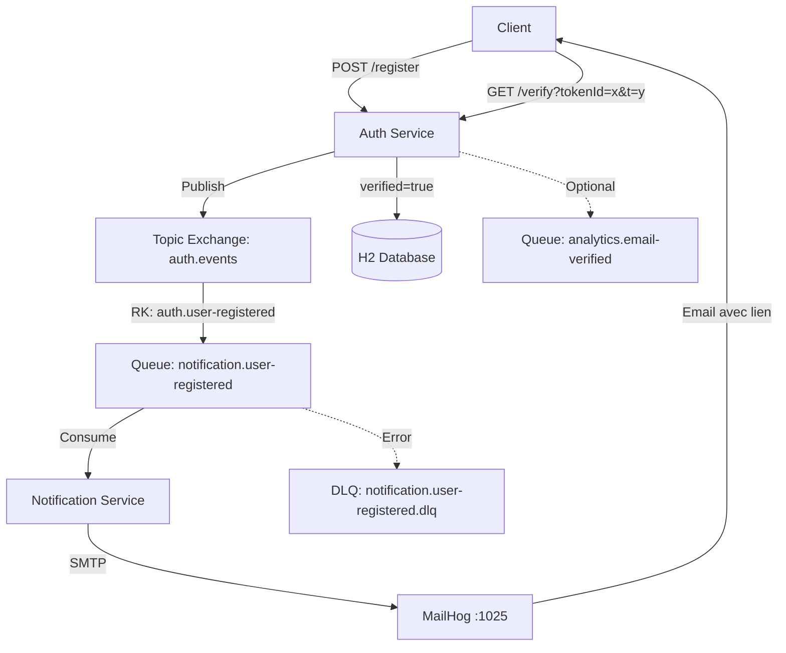

# Plan d'Implémentation TP - Vérification Email avec RabbitMQ

Transformation conforme aux spécifications académiques du TP M1 Architecture & Services.

## Architecture Cible



## Flux de Vérification Détaillé

1. **Registration** : User → `POST /register { email, password }`
2. **Token Generation** : Auth génère `tokenId` (UUID) + `tokenClear` (UUID secret)
3. **Token Hashing** : Stocke `BCrypt(tokenClear)` + `expiresAt` (TTL 15-30min)
4. **Event Publishing** : Auth publie `UserRegisteredEvent` → Topic Exchange `auth.events`
5. **Routing** : RabbitMQ route via `auth.user-registered` → Queue `notification.user-registered`
6. **Email Sending** : Notification consomme → construit lien → envoie via MailHog
7. **User Verification** : User clique lien → `GET /verify?tokenId=x&t=y`
8. **Token Validation** : Auth vérifie expiration + compare `BCrypt(t)` avec `tokenHash`
9. **Account Activation** : Marque `verified=true`, supprime token (one-shot)
10. **Analytics (optionnel)** : Publie `EmailVerified` event

---

## Phase 1 : Infrastructure Docker

### Docker Compose

#### [NEW] [docker-compose.yml](file:///c:/Users/camar/OneDrive/Documents/Master%201/Semestre%202/Introduction%20to%20architecture/Labs/Spring-Auth/docker-compose.yml)

```yaml
version: '3.8'

services:
  rabbitmq:
    image: rabbitmq:3-management
    container_name: rabbitmq
    ports:
      - "5672:5672"   # AMQP
      - "15672:15672" # Management UI
    environment:
      RABBITMQ_DEFAULT_USER: guest
      RABBITMQ_DEFAULT_PASS: guest
    networks:
      - microservices

  mailhog:
    image: mailhog/mailhog
    container_name: mailhog
    ports:
      - "1025:1025" # SMTP
      - "8025:8025" # Web UI
    networks:
      - microservices

  auth-service:
    build:
      context: .
      dockerfile: Dockerfile
    container_name: auth-service
    ports:
      - "8080:8080"
    environment:
      SPRING_RABBITMQ_HOST: rabbitmq
      SPRING_RABBITMQ_PORT: 5672
      SPRING_RABBITMQ_USERNAME: guest
      SPRING_RABBITMQ_PASSWORD: guest
    depends_on:
      - rabbitmq
    networks:
      - microservices

  notification-service:
    build:
      context: ./notification-service
      dockerfile: Dockerfile
    container_name: notification-service
    ports:
      - "8081:8081"
    environment:
      SPRING_RABBITMQ_HOST: rabbitmq
      SPRING_RABBITMQ_PORT: 5672
      SPRING_RABBITMQ_USERNAME: guest
      SPRING_RABBITMQ_PASSWORD: guest
      SPRING_MAIL_HOST: mailhog
      SPRING_MAIL_PORT: 1025
    depends_on:
      - rabbitmq
      - mailhog
    networks:
      - microservices

networks:
  microservices:
    driver: bridge
```

#### [NEW] [Dockerfile](file:///c:/Users/camar/OneDrive/Documents/Master%201/Semestre%202/Introduction%20to%20architecture/Labs/Spring-Auth/Dockerfile)

```dockerfile
FROM maven:3.8.5-openjdk-17 AS build
WORKDIR /app
COPY pom.xml .
COPY src ./src
RUN mvn clean package -DskipTests

FROM openjdk:17-jdk-slim
WORKDIR /app
COPY --from=build /app/target/*.jar app.jar
EXPOSE 8080
ENTRYPOINT ["java", "-jar", "app.jar"]
```

---

## Phase 2 : Auth Service - Modèle de Données Sécurisé

### Entities

#### [MODIFY] [Identity.java](file:///c:/Users/camar/OneDrive/Documents/Master%201/Semestre%202/Introduction%20to%20architecture/Labs/Spring-Auth/src/main/java/demo/model/Identity.java)

Ajouter le champ `verified` :

```java
@Column(nullable = false)
private boolean verified = false;

public boolean isVerified() {
    return verified;
}

public void setVerified(boolean verified) {
    this.verified = verified;
}
```

**Note** : Ne PAS stocker de token dans Identity (violation sécurité).

#### [NEW] [VerificationToken.java](file:///c:/Users/camar/OneDrive/Documents/Master%201/Semestre%202/Introduction%20to%20architecture/Labs/Spring-Auth/src/main/java/demo/model/VerificationToken.java)

Entity séparée selon spécifications TP :

```java
@Entity
@Table(name = "verification_tokens")
public class VerificationToken {
    @Id
    @Column(nullable = false, unique = true)
    private String tokenId;  // UUID public
    
    @Column(nullable = false)
    private Long userId;
    
    @Column(nullable = false)
    private String tokenHash;  // BCrypt hash du tokenClear
    
    @Column(nullable = false)
    private LocalDateTime expiresAt;
    
    @Column(nullable = false)
    private LocalDateTime createdAt;
    
    // Constructors, Getters, Setters
}
```

**Principe sécurité** : `tokenClear` n'est JAMAIS stocké, seulement `tokenHash = BCrypt(tokenClear)`.

#### [NEW] [VerificationTokenRepository.java](file:///c:/Users/camar/OneDrive/Documents/Master%201/Semestre%202/Introduction%20to%20architecture/Labs/Spring-Auth/src/main/java/demo/repository/VerificationTokenRepository.java)

```java
public interface VerificationTokenRepository extends JpaRepository<VerificationToken, String> {
    Optional<VerificationToken> findByTokenId(String tokenId);
    void deleteByUserId(Long userId);
}
```

---

## Phase 3 : Auth Service - Configuration RabbitMQ avec DLQ

### Dépendances Maven

#### [MODIFY] [pom.xml](file:///c:/Users/camar/OneDrive/Documents/Master%201/Semestre%202/Introduction%20to%20architecture/Labs/Spring-Auth/pom.xml)

```xml
<!-- RabbitMQ -->
<dependency>
    <groupId>org.springframework.boot</groupId>
    <artifactId>spring-boot-starter-amqp</artifactId>
</dependency>

<!-- BCrypt déjà présent via Spring Security -->
```

### Configuration YAML

#### [MODIFY] [application.yml](file:///c:/Users/camar/OneDrive/Documents/Master%201/Semestre%202/Introduction%20to%20architecture/Labs/Spring-Auth/src/main/resources/application.yml)

Créer/modifier pour utiliser YAML (remplacer application.properties) :

```yaml
spring:
  application:
    name: auth-service
  
  datasource:
    url: jdbc:h2:file:./data/authdb
    driver-class-name: org.h2.Driver
    username: sa
    password:
  
  jpa:
    hibernate:
      ddl-auto: update
    show-sql: true
  
  h2:
    console:
      enabled: true
  
  rabbitmq:
    host: ${SPRING_RABBITMQ_HOST:localhost}
    port: ${SPRING_RABBITMQ_PORT:5672}
    username: ${SPRING_RABBITMQ_USERNAME:guest}
    password: ${SPRING_RABBITMQ_PASSWORD:guest}

app:
  mq:
    exchange: auth.events
    rk:
      userRegistered: auth.user-registered
      emailVerified: auth.email-verified
  verification:
    baseUrl: http://localhost:8080
    tokenTTLMinutes: 30
```

### Configuration Java

#### [NEW] [RabbitMQConfig.java](file:///c:/Users/camar/OneDrive/Documents/Master%201/Semestre%202/Introduction%20to%20architecture/Labs/Spring-Auth/src/main/java/demo/config/RabbitMQConfig.java)

Configuration Topic Exchange + DLQ selon TP :

```java
@Configuration
public class RabbitMQConfig {
    @Value("${app.mq.exchange}")
    private String exchangeName;
    
    @Bean
    public TopicExchange authEventsExchange() {
        return new TopicExchange(exchangeName, true, false);
    }
    
    @Bean
    public Jackson2JsonMessageConverter messageConverter() {
        return new Jackson2JsonMessageConverter();
    }
    
    @Bean
    public RabbitTemplate rabbitTemplate(ConnectionFactory connectionFactory) {
        RabbitTemplate template = new RabbitTemplate(connectionFactory);
        template.setMessageConverter(messageConverter());
        return template;
    }
}
```

---

## Phase 4 : Auth Service - Événements Structurés

### DTOs

#### [NEW] [UserRegisteredEvent.java](file:///c:/Users/camar/OneDrive/Documents/Master%201/Semestre%202/Introduction%20to%20architecture/Labs/Spring-Auth/src/main/java/demo/dto/UserRegisteredEvent.java)

Structure conforme au schéma TP :

```java
public class UserRegisteredEvent {
    private String eventId;           // UUID
    private LocalDateTime occurredAt;
    private UserRegisteredData data;
    private EventHeaders headers;
    
    // Nested classes
    public static class UserRegisteredData {
        private String userId;
        private String email;
        private String tokenId;
        private String tokenClear;  // Inclus uniquement pour TP simple
        // Getters, Setters
    }
    
    public static class EventHeaders {
        private String correlationId;  // x-correlation-id
        private int schemaVersion;     // x-schema-version
        // Getters, Setters
    }
    
    // Constructors, Getters, Setters
}
```

#### [NEW] [EmailVerifiedEvent.java](file:///c:/Users/camar/OneDrive/Documents/Master%201/Semestre%202/Introduction%20to%20architecture/Labs/Spring-Auth/src/main/java/demo/dto/EmailVerifiedEvent.java)

Événement optionnel pour analytics :

```java
public class EmailVerifiedEvent {
    private String eventId;
    private String userId;
    private LocalDateTime occurredAt;
    private EventHeaders headers;
    // Constructors, Getters, Setters
}
```

---

## Phase 5 : Auth Service - Producer RabbitMQ

#### [NEW] [RabbitMQProducer.java](file:///c:/Users/camar/OneDrive/Documents/Master%201/Semestre%202/Introduction%20to%20architecture/Labs/Spring-Auth/src/main/java/demo/service/RabbitMQProducer.java)

```java
@Service
public class RabbitMQProducer {
    @Autowired
    private RabbitTemplate rabbitTemplate;
    
    @Value("${app.mq.exchange}")
    private String exchange;
    
    @Value("${app.mq.rk.userRegistered}")
    private String rkUserRegistered;
    
    @Value("${app.mq.rk.emailVerified}")
    private String rkEmailVerified;
    
    public void publishUserRegistered(UserRegisteredEvent event) {
        MessageProperties props = new MessageProperties();
        props.setHeader("x-correlation-id", event.getHeaders().getCorrelationId());
        props.setHeader("x-schema-version", event.getHeaders().getSchemaVersion());
        
        rabbitTemplate.convertAndSend(exchange, rkUserRegistered, event, 
            msg -> {
                msg.getMessageProperties().setHeaders(props.getHeaders());
                return msg;
            });
        
        log.info("Published UserRegistered event: {}", event.getEventId());
    }
    
    public void publishEmailVerified(EmailVerifiedEvent event) {
        rabbitTemplate.convertAndSend(exchange, rkEmailVerified, event);
        log.info("Published EmailVerified event: {}", event.getEventId());
    }
}
```

---

## Phase 6 : Auth Service - Logique Métier avec Hashing

#### [MODIFY] [AuthService.java](file:///c:/Users/camar/OneDrive/Documents/Master%201/Semestre%202/Introduction%20to%20architecture/Labs/Spring-Auth/src/main/java/demo/service/AuthService.java)

Implémenter selon spécifications TP :

**Méthode `register` :**

```java
@Transactional
public UserRegisteredEvent register(String email, String password) {
    // 1. Créer User (verified=false)
    Identity user = new Identity();
    user.setEmail(email);
    user.setPassword(passwordEncoder.encode(password));
    user.setVerified(false);
    user = identityRepository.save(user);
    
    // 2. Générer tokens
    String tokenId = UUID.randomUUID().toString();
    String tokenClear = UUID.randomUUID().toString();
    
    // 3. Hasher avec BCrypt (principe sécurité TP)
    String tokenHash = passwordEncoder.encode(tokenClear);
    
    // 4. Calculer expiration (TTL 30 min)
    LocalDateTime expiresAt = LocalDateTime.now().plusMinutes(30);
    
    // 5. Sauvegarder VerificationToken
    VerificationToken token = new VerificationToken();
    token.setTokenId(tokenId);
    token.setUserId(user.getId());
    token.setTokenHash(tokenHash);
    token.setExpiresAt(expiresAt);
    token.setCreatedAt(LocalDateTime.now());
    verificationTokenRepository.save(token);
    
    // 6. Construire événement structuré
    String correlationId = UUID.randomUUID().toString();
    UserRegisteredEvent event = new UserRegisteredEvent();
    event.setEventId(UUID.randomUUID().toString());
    event.setOccurredAt(LocalDateTime.now());
    
    UserRegisteredEvent.UserRegisteredData data = new UserRegisteredEvent.UserRegisteredData();
    data.setUserId(user.getId().toString());
    data.setEmail(email);
    data.setTokenId(tokenId);
    data.setTokenClear(tokenClear); // Pour TP simple (sera dans lien email)
    event.setData(data);
    
    UserRegisteredEvent.EventHeaders headers = new UserRegisteredEvent.EventHeaders();
    headers.setCorrelationId(correlationId);
    headers.setSchemaVersion(1);
    event.setHeaders(headers);
    
    // 7. Publier événement RabbitMQ
    rabbitMQProducer.publishUserRegistered(event);
    
    log.info("User registered: {} | correlationId: {}", email, correlationId);
    return event;
}
```

**Nouvelle méthode `verifyAccount` :**

```java
@Transactional
public void verifyAccount(String tokenId, String tokenClear) {
    // 1. Récupérer token
    VerificationToken token = verificationTokenRepository.findByTokenId(tokenId)
        .orElseThrow(() -> new IllegalArgumentException("Invalid token"));
    
    // 2. Vérifier expiration
    if (LocalDateTime.now().isAfter(token.getExpiresAt())) {
        throw new IllegalArgumentException("Token expired");
    }
    
    // 3. Comparer BCrypt(tokenClear) avec tokenHash
    if (!passwordEncoder.matches(tokenClear, token.getTokenHash())) {
        throw new IllegalArgumentException("Invalid token");
    }
    
    // 4. Récupérer User
    Identity user = identityRepository.findById(token.getUserId())
        .orElseThrow(() -> new IllegalArgumentException("User not found"));
    
    // 5. Idempotence (ne pas échouer si déjà vérifié)
    if (user.isVerified()) {
        log.warn("User already verified: {}", user.getEmail());
        return;
    }
    
    // 6. Marquer verified=true
    user.setVerified(true);
    identityRepository.save(user);
    
    // 7. Supprimer token (one-shot)
    verificationTokenRepository.deleteByTokenId(tokenId);
    
    // 8. (Optionnel) Publier EmailVerified
    EmailVerifiedEvent event = new EmailVerifiedEvent();
    event.setEventId(UUID.randomUUID().toString());
    event.setUserId(user.getId().toString());
    event.setOccurredAt(LocalDateTime.now());
    rabbitMQProducer.publishEmailVerified(event);
    
    log.info("User verified: {}", user.getEmail());
}
```

**Modifier méthode `login` :**

```java
public String login(String email, String password) {
    Identity user = identityRepository.findByEmail(email)
        .orElseThrow(() -> new IllegalArgumentException("Invalid credentials"));
    
    if (!passwordEncoder.matches(password, user.getPassword())) {
        throw new IllegalArgumentException("Invalid credentials");
    }
    
    // Vérification du statut verified
    if (!user.isVerified()) {
        throw new IllegalStateException("Account not verified. Please check your email.");
    }
    
    // Générer JWT
    return jwtService.generateToken(user);
}
```

---

## Phase 7 : Auth Service - Controllers

#### [MODIFY] [IdentifyController.java](file:///c:/Users/camar/OneDrive/Documents/Master%201/Semestre%202/Introduction%20to%20architecture/Labs/Spring-Auth/src/main/java/demo/controller/IdentifyController.java)

**Modifier POST /register :**

```java
@PostMapping("/register")
public ResponseEntity<?> register(@RequestBody RegisterRequest request) {
    try {
        authService.register(request.getEmail(), request.getPassword());
        return ResponseEntity.status(HttpStatus.CREATED)
            .body(Map.of("message", "Registration successful. Please check your email."));
    } catch (Exception e) {
        return ResponseEntity.badRequest().body(Map.of("error", e.getMessage()));
    }
}
```

**Ajouter GET /verify :**

```java
@GetMapping("/verify")
public ResponseEntity<?> verifyAccount(
        @RequestParam String tokenId,
        @RequestParam String t) {
    try {
        authService.verifyAccount(tokenId, t);
        return ResponseEntity.ok(Map.of("message", "Account verified successfully!"));
    } catch (IllegalArgumentException e) {
        return ResponseEntity.badRequest().body(Map.of("error", e.getMessage()));
    }
}
```

**Modifier POST /login :**

```java
@PostMapping("/login")
public ResponseEntity<?> login(@RequestBody LoginRequest request) {
    try {
        String token = authService.login(request.getEmail(), request.getPassword());
        return ResponseEntity.ok(Map.of("token", token));
    } catch (IllegalStateException e) {
        // Account not verified
        return ResponseEntity.status(HttpStatus.FORBIDDEN)
            .body(Map.of("error", e.getMessage()));
    } catch (IllegalArgumentException e) {
        return ResponseEntity.badRequest().body(Map.of("error", e.getMessage()));
    }
}
```

---

## Phase 8 : Notification Service - Structure Complète

### Projet Maven

#### [NEW] [pom.xml](file:///c:/Users/camar/OneDrive/Documents/Master%201/Semestre%202/Introduction%20to%20architecture/Labs/Spring-Auth/notification-service/pom.xml)

```xml
<?xml version="1.0" encoding="UTF-8"?>
<project xmlns="http://maven.apache.org/POM/4.0.0"
         xmlns:xsi="http://www.w3.org/2001/XMLSchema-instance"
         xsi:schemaLocation="http://maven.apache.org/POM/4.0.0 
         http://maven.apache.org/xsd/maven-4.0.0.xsd">
    <modelVersion>4.0.0</modelVersion>
    
    <parent>
        <groupId>org.springframework.boot</groupId>
        <artifactId>spring-boot-starter-parent</artifactId>
        <version>3.2.0</version>
    </parent>
    
    <groupId>demo</groupId>
    <artifactId>notification-service</artifactId>
    <version>1.0.0</version>
    
    <dependencies>
        <!-- Spring Boot Web -->
        <dependency>
            <groupId>org.springframework.boot</groupId>
            <artifactId>spring-boot-starter-web</artifactId>
        </dependency>
        
        <!-- RabbitMQ -->
        <dependency>
            <groupId>org.springframework.boot</groupId>
            <artifactId>spring-boot-starter-amqp</artifactId>
        </dependency>
        
        <!-- Spring Mail -->
        <dependency>
            <groupId>org.springframework.boot</groupId>
            <artifactId>spring-boot-starter-mail</artifactId>
        </dependency>
        
        <!-- Thymeleaf -->
        <dependency>
            <groupId>org.springframework.boot</groupId>
            <artifactId>spring-boot-starter-thymeleaf</artifactId>
        </dependency>
        
        <!-- Lombok (optionnel) -->
        <dependency>
            <groupId>org.projectlombok</groupId>
            <artifactId>lombok</artifactId>
            <optional>true</optional>
        </dependency>
    </dependencies>
    
    <build>
        <plugins>
            <plugin>
                <groupId>org.springframework.boot</groupId>
                <artifactId>spring-boot-maven-plugin</artifactId>
            </plugin>
        </plugins>
    </build>
</project>
```

### Configuration

#### [NEW] [application.yml](file:///c:/Users/camar/OneDrive/Documents/Master%201/Semestre%202/Introduction%20to%20architecture/Labs/Spring-Auth/notification-service/src/main/resources/application.yml)

```yaml
server:
  port: 8081

spring:
  application:
    name: notification-service
  
  rabbitmq:
    host: ${SPRING_RABBITMQ_HOST:localhost}
    port: ${SPRING_RABBITMQ_PORT:5672}
    username: ${SPRING_RABBITMQ_USERNAME:guest}
    password: ${SPRING_RABBITMQ_PASSWORD:guest}
    listener:
      simple:
        retry:
          enabled: true
          max-attempts: 3
          initial-interval: 2000
  
  mail:
    host: ${SPRING_MAIL_HOST:localhost}
    port: ${SPRING_MAIL_PORT:1025}
    properties:
      mail.smtp.auth: false
      mail.smtp.starttls.enable: false

app:
  mq:
    exchange: auth.events
    queue:
      userRegistered: notification.user-registered
    dlx: auth.events.dlx
    dlq:
      userRegistered: notification.user-registered.dlq
  verification:
    baseUrl: http://localhost:8080
```

### Application Principale

#### [NEW] [NotificationServiceApplication.java](file:///c:/Users/camar/OneDrive/Documents/Master%201/Semestre%202/Introduction%20to%20architecture/Labs/Spring-Auth/notification-service/src/main/java/demo/notification/NotificationServiceApplication.java)

```java
@SpringBootApplication
public class NotificationServiceApplication {
    public static void main(String[] args) {
        SpringApplication.run(NotificationServiceApplication.class, args);
    }
}
```

### Configuration RabbitMQ avec DLQ

#### [NEW] [RabbitMQConfig.java](file:///c:/Users/camar/OneDrive/Documents/Master%201/Semestre%202/Introduction%20to%20architecture/Labs/Spring-Auth/notification-service/src/main/java/demo/notification/config/RabbitMQConfig.java)

Configuration complète Queue + DLQ selon TP :

```java
@Configuration
public class RabbitMQConfig {
    @Value("${app.mq.exchange}")
    private String exchangeName;
    
    @Value("${app.mq.queue.userRegistered}")
    private String queueName;
    
    @Value("${app.mq.dlx}")
    private String dlxName;
    
    @Value("${app.mq.dlq.userRegistered}")
    private String dlqName;
    
    // Exchange principal
    @Bean
    public TopicExchange authEventsExchange() {
        return new TopicExchange(exchangeName, true, false);
    }
    
    // Dead Letter Exchange
    @Bean
    public DirectExchange deadLetterExchange() {
        return new DirectExchange(dlxName, true, false);
    }
    
    // Queue principale avec DLX
    @Bean
    public Queue userRegisteredQueue() {
        return QueueBuilder.durable(queueName)
            .withArgument("x-dead-letter-exchange", dlxName)
            .withArgument("x-dead-letter-routing-key", dlqName)
            .build();
    }
    
    // Dead Letter Queue
    @Bean
    public Queue userRegisteredDLQ() {
        return new Queue(dlqName, true);
    }
    
    // Binding Queue → Exchange
    @Bean
    public Binding bindingUserRegistered() {
        return BindingBuilder.bind(userRegisteredQueue())
            .to(authEventsExchange())
            .with("auth.user-registered");
    }
    
    // Binding DLQ → DLX
    @Bean
    public Binding bindingDLQ() {
        return BindingBuilder.bind(userRegisteredDLQ())
            .to(deadLetterExchange())
            .with(dlqName);
    }
    
    @Bean
    public Jackson2JsonMessageConverter messageConverter() {
        return new Jackson2JsonMessageConverter();
    }
}
```

### Consumer RabbitMQ

#### [NEW] [RegistrationConsumer.java](file:///c:/Users/camar/OneDrive/Documents/Master%201/Semestre%202/Introduction%20to%20architecture/Labs/Spring-Auth/notification-service/src/main/java/demo/notification/consumer/RegistrationConsumer.java)

Consumer avec gestion d'erreurs → DLQ :

```java
@Component
@Slf4j
public class RegistrationConsumer {
    @Autowired
    private EmailService emailService;
    
    @RabbitListener(queues = "${app.mq.queue.userRegistered}")
    public void handleUserRegistered(@Payload UserRegisteredEvent event,
                                     @Header(value = "x-correlation-id", required = false) String correlationId) {
        try {
            log.info("Received UserRegistered event: {} | correlationId: {}", 
                event.getEventId(), correlationId);
            
            emailService.sendVerificationEmail(event);
            
            log.info("Email sent successfully for user: {} | correlationId: {}", 
                event.getData().getEmail(), correlationId);
        } catch (Exception e) {
            log.error("Failed to send email | eventId: {} | correlationId: {} | error: {}", 
                event.getEventId(), correlationId, e.getMessage());
            // Exception → RabbitMQ retry → DLQ si max-attempts atteint
            throw new RuntimeException("Email sending failed", e);
        }
    }
}
```

### Service Email

#### [NEW] [EmailService.java](file:///c:/Users/camar/OneDrive/Documents/Master%201/Semestre%202/Introduction%20to%20architecture/Labs/Spring-Auth/notification-service/src/main/java/demo/notification/service/EmailService.java)

```java
@Service
@Slf4j
public class EmailService {
    @Autowired
    private JavaMailSender mailSender;
    
    @Autowired
    private TemplateEngine templateEngine;
    
    @Value("${app.verification.baseUrl}")
    private String baseUrl;
    
    public void sendVerificationEmail(UserRegisteredEvent event) throws MessagingException {
        String email = event.getData().getEmail();
        String tokenId = event.getData().getTokenId();
        String tokenClear = event.getData().getTokenClear();
        
        // Construire lien de vérification selon TP
        String verificationUrl = String.format("%s/verify?tokenId=%s&t=%s", 
            baseUrl, tokenId, tokenClear);
        
        // Contexte Thymeleaf
        Context context = new Context();
        context.setVariable("email", email);
        context.setVariable("verificationUrl", verificationUrl);
        
        // Générer HTML depuis template
        String htmlContent = templateEngine.process("verification-email", context);
        
        // Créer email
        MimeMessage message = mailSender.createMimeMessage();
        MimeMessageHelper helper = new MimeMessageHelper(message, true, "UTF-8");
        
        helper.setTo(email);
        helper.setSubject("Vérifiez votre compte");
        helper.setText(htmlContent, true);
        helper.setFrom("noreply@auth-service.com");
        
        // Envoyer via MailHog
        mailSender.send(message);
        
        log.info("Verification email sent to: {} | URL: {}", email, verificationUrl);
    }
}
```

### Template Email

#### [NEW] [verification-email.html](file:///c:/Users/camar/OneDrive/Documents/Master%201/Semestre%202/Introduction%20to%20architecture/Labs/Spring-Auth/notification-service/src/main/resources/templates/verification-email.html)

```html
<!DOCTYPE html>
<html xmlns:th="http://www.thymeleaf.org">
<head>
    <meta charset="UTF-8">
    <meta name="viewport" content="width=device-width, initial-scale=1.0">
    <title>Vérification de compte</title>
    <style>
        body { font-family: Arial, sans-serif; background-color: #f4f4f4; padding: 20px; }
        .container { max-width: 600px; margin: 0 auto; background: white; padding: 30px; border-radius: 8px; }
        h1 { color: #333; }
        .button { display: inline-block; padding: 12px 24px; background-color: #007bff; 
                  color: white; text-decoration: none; border-radius: 4px; margin-top: 20px; }
        .footer { margin-top: 30px; font-size: 12px; color: #777; }
    </style>
</head>
<body>
    <div class="container">
        <h1>Bienvenue !</h1>
        <p>Bonjour <span th:text="${email}"></span>,</p>
        <p>Merci de vous être inscrit. Veuillez cliquer sur le bouton ci-dessous pour vérifier votre compte :</p>
        
        <a th:href="${verificationUrl}" class="button">Vérifier mon compte</a>
        
        <p style="margin-top: 20px; font-size: 14px; color: #555;">
            Ou copiez ce lien dans votre navigateur :
            <br><span th:text="${verificationUrl}" style="color: #007bff;"></span>
        </p>
        
        <div class="footer">
            <p>Ce lien expire dans 30 minutes.</p>
            <p>Si vous n'avez pas créé de compte, ignorez cet email.</p>
        </div>
    </div>
</body>
</html>
```

### DTO

#### [NEW] [UserRegisteredEvent.java](file:///c:/Users/camar/OneDrive/Documents/Master%201/Semestre%202/Introduction%20to%20architecture/Labs/Spring-Auth/notification-service/src/main/java/demo/notification/dto/UserRegisteredEvent.java)

Copie identique du DTO Auth Service (structure commune).

### Dockerfile

#### [NEW] [Dockerfile](file:///c:/Users/camar/OneDrive/Documents/Master%201/Semestre%202/Introduction%20to%20architecture/Labs/Spring-Auth/notification-service/Dockerfile)

```dockerfile
FROM maven:3.8.5-openjdk-17 AS build
WORKDIR /app
COPY pom.xml .
COPY src ./src
RUN mvn clean package -DskipTests

FROM openjdk:17-jdk-slim
WORKDIR /app
COPY --from=build /app/target/*.jar app.jar
EXPOSE 8081
ENTRYPOINT ["java", "-jar", "app.jar"]
```

---

## Verification Plan

### Démarrage Infrastructure

```bash
# Construire et démarrer tous les services
docker-compose up --build

# Vérifier les services actifs
docker ps
```

**URLs de vérification :**
- RabbitMQ Management : http://localhost:15672 (guest/guest)
- MailHog Web UI : http://localhost:8025
- Auth Service : http://localhost:8080
- Notification Service : http://localhost:8081

### Test 1 : Registration + Event Publishing

**Requête Postman :**
```http
POST http://localhost:8080/register
Content-Type: application/json

{
  "email": "test@example.com",
  "password": "SecurePass123"
}
```

**Vérifications :**
1. ✅ Réponse 201 : `"Registration successful. Please check your email."`
2. ✅ RabbitMQ UI : Message dans queue `notification.user-registered`
3. ✅ Headers : `x-correlation-id` et `x-schema-version` présents
4. ✅ H2 Console : User créé avec `verified=false`
5. ✅ H2 Console : VerificationToken créé avec `tokenHash` (BCrypt) et `expiresAt`

### Test 2 : Email Reception

**MailHog UI (http://localhost:8025) :**
1. ✅ Email reçu avec sujet "Vérifiez votre compte"
2. ✅ Lien format : `http://localhost:8080/verify?tokenId=xxx&t=yyy`
3. ✅ Design HTML responsive

**Logs Notification Service :**
```
Received UserRegistered event: <eventId> | correlationId: <uuid>
Email sent successfully for user: test@example.com
```

### Test 3 : Verification Successful

**Action :** Cliquer sur le lien dans l'email MailHog

**Vérifications :**
1. ✅ Réponse 200 : `"Account verified successfully!"`
2. ✅ H2 Console : User `verified=true`
3. ✅ H2 Console : VerificationToken supprimé (one-shot)
4. ✅ RabbitMQ UI : Événement `EmailVerified` publié (si optionnel implémenté)

### Test 4 : Idempotence

**Action :** Re-cliquer sur le même lien de vérification

**Vérifications :**
1. ✅ Réponse 200 (ne pas échouer)
2. ✅ Logs : "User already verified"
3. ✅ Pas d'erreur côté serveur

### Test 5 : Token Expired

**Setup :** Modifier TTL à 1 minute, attendre expiration

**Requête :**
```http
GET http://localhost:8080/verify?tokenId=xxx&t=yyy
```

**Vérifications :**
1. ✅ Réponse 400 : `"Token expired"`
2. ✅ User reste `verified=false`

### Test 6 : Token Invalid

**Requête avec token invalide :**
```http
GET http://localhost:8080/verify?tokenId=xxx&t=wrong-token
```

**Vérifications :**
1. ✅ Réponse 400 : `"Invalid token"`
2. ✅ BCrypt comparison échoue

### Test 7 : Login Before Verification

**Requête :**
```http
POST http://localhost:8080/login
Content-Type: application/json

{
  "email": "unverified@example.com",
  "password": "SecurePass123"
}
```

**Vérifications :**
1. ✅ Réponse 403 : `"Account not verified. Please check your email."`
2. ✅ Pas de token JWT retourné

### Test 8 : Login After Verification

**Requête :** Même requête avec compte vérifié

**Vérifications :**
1. ✅ Réponse 200 avec token JWT
2. ✅ Authentification réussie

### Test 9 : DLQ Testing

**Simulation erreur :**
1. Arrêter MailHog : `docker stop mailhog`
2. POST /register → Event publié
3. Notification Service consomme → erreur SMTP
4. RabbitMQ retry 3 fois (config `max-attempts: 3`)

**Vérifications :**
1. ✅ RabbitMQ UI : Message déplacé vers DLQ `notification.user-registered.dlq`
2. ✅ Logs : "Failed to send email"
3. ✅ Redémarrer MailHog → traiter manuellement le message DLQ si nécessaire

### Test 10 : Correlation ID Tracing

**Vérifier logs bout-en-bout :**
1. ✅ Auth Service : `correlationId: <uuid>` lors du register
2. ✅ RabbitMQ headers : `x-correlation-id: <uuid>`
3. ✅ Notification Service : `correlationId: <uuid>` lors de la consommation
4. ✅ Même UUID dans tous les logs → traçabilité complète

---

## Critères d'Évaluation TP

### Flux Fonctionnel (40%)
- [x] POST /register crée User + Token hashé
- [x] Événement publié vers RabbitMQ
- [x] Email envoyé via MailHog
- [x] GET /verify valide le compte
- [x] Login bloqué avant vérification

### Sécurité (25%)
- [x] Token stocké en BCrypt (jamais en clair)
- [x] Expiration TTL respectée (15-30 min)
- [x] One-shot token (suppression après usage)
- [x] Idempotence implémentée

### Messagerie (20%)
- [x] Topic Exchange configuré
- [x] Routing keys correctes
- [x] DLQ opérationnelle
- [x] Retry configuré (3 attempts)

### Qualité (15%)
- [x] Logs avec correlationId
- [x] Structure événements conforme au schéma TP
- [x] Tests manuels reproductibles
- [x] README avec instructions

---

## Annexe : Commandes Utiles

```bash
# Démarrer infrastructure
docker-compose up --build -d

# Voir les logs
docker-compose logs -f auth-service
docker-compose logs -f notification-service

# H2 Console (Auth Service)
http://localhost:8080/h2-console
JDBC URL: jdbc:h2:file:./data/authdb

# Arrêter tout
docker-compose down

# Nettoyer volumes
docker-compose down -v
```
